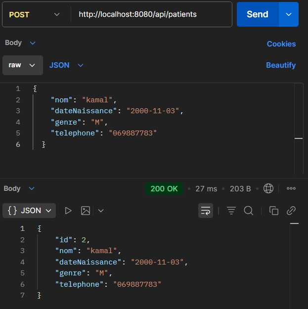
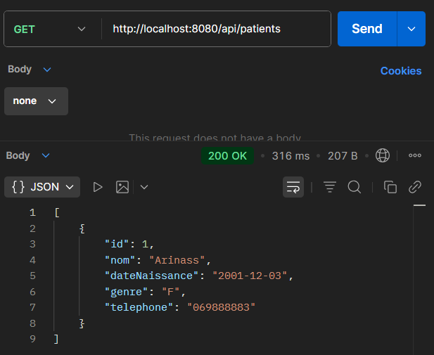
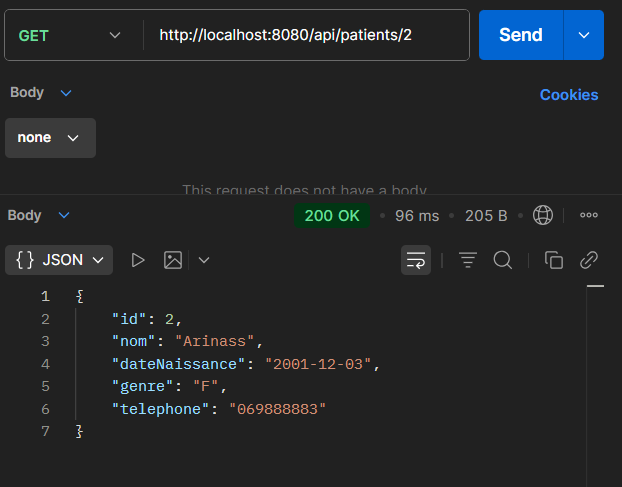
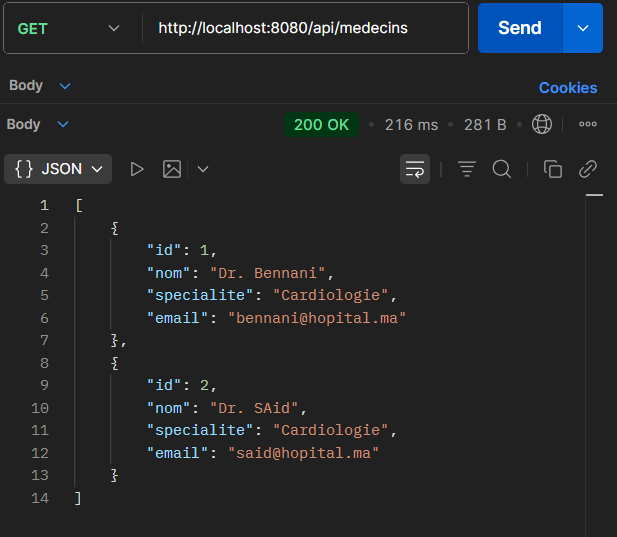
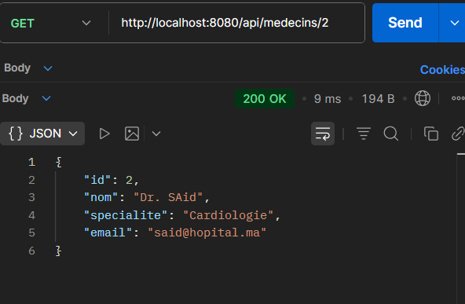
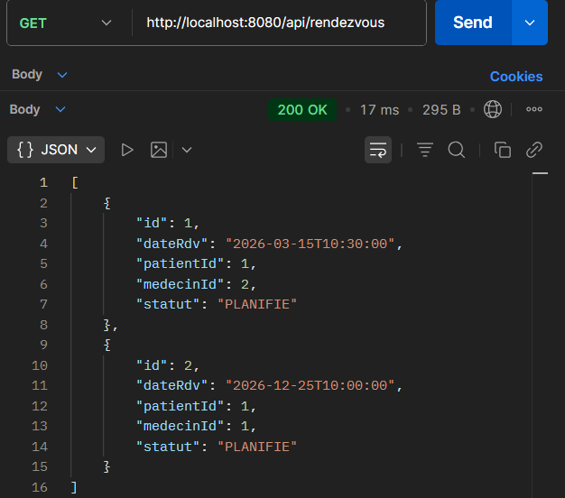
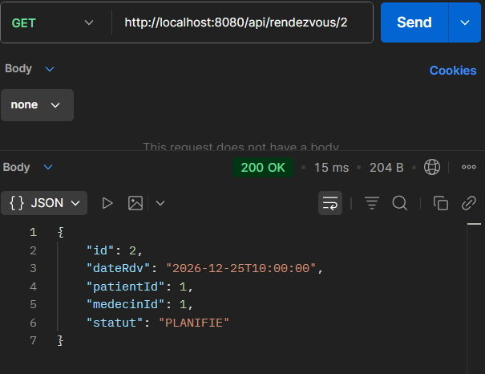
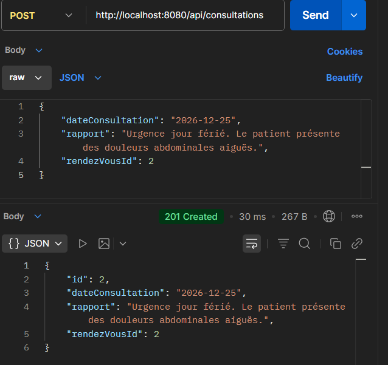
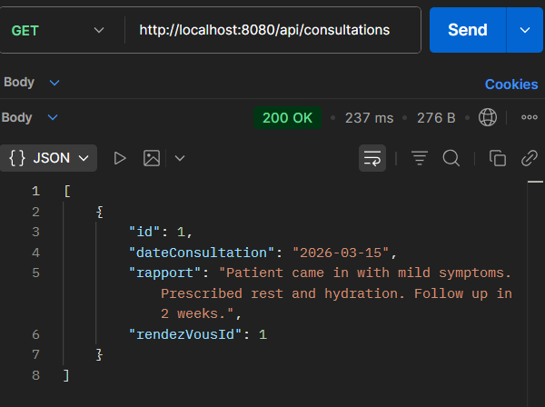
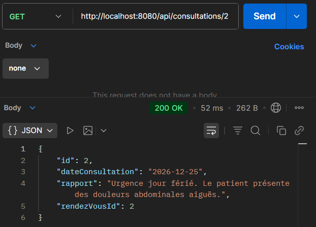

# **Rapport de TP3 : Mise en œuvre d'une architecture Microservices**

**Université :** Faculté des Sciences de Rabat

**Module :** Systèmes Distribués Basés sur les Microservices

**Sujet :** Architecture Microservices avec Spring Cloud Gateway

**Réalisé par :** Abderrahmane HAMYD

**Encadré par :** Pr. Jaouad OUHSSAINE

## **1\. Contexte et Objectifs**

Dans le cadre de ce travail pratique, nous avons fait évoluer l'architecture SOA mise en place lors du TP2 vers une architecture **Microservices** complète.

L'objectif principal était de supprimer le couplage fort induit par le dépôt partagé (cabinet-repo) et de remplacer l'ESB par une **API Gateway** légère, garantissant ainsi l'autonomie stricte de chaque service.

### **Objectifs Techniques Atteints :**

* **Découplage des Données :** Chaque microservice gère désormais sa propre base de données (H2) et ses propres entités.  
* **Point d'Entrée Unique :** Mise en place de **Spring Cloud Gateway** pour centraliser et router les requêtes externes.  
* **Communication Inter-services :** Utilisation de clients REST (RestTemplate/OpenFeign) pour les interactions synchrones (ex: vérification de l'existence d'un patient lors de la prise de RDV).

## **2\. Architecture Technique**

L'écosystème est composé de services autonomes, exposant chacun une API REST interne (/internal/api/v1/...), sécurisée et masquée par la Gateway.

### **Structure du Projet**

| Module | Type | Port | Description |
| :---- | :---- | :---- | :---- |
| **api-gateway** | **Gateway** | 8080 | Proxy inverse basé sur Spring Cloud Gateway. Route les requêtes /api/\* vers les instances internes. |
| **patient-service** | Microservice | 8082 | Gestion CRUD des patients. Base de données isolée. |
| **medecin-service** | Microservice | 8083 | Gestion des médecins et spécialités. Base de données isolée. |
| **rendezvous-service** | Microservice | 8084 | Gestion des plannings. Consomme les API de Patient et Médecin. |
| **consultation-service** | Microservice | 8085 | Gestion des consultations. Consomme l'API de Rendez-vous. |

### **Stack Technologique**

* **Framework :** Spring Boot 3.x  
* **Routing & Resilience :** Spring Cloud Gateway  
* **Communication :** REST (RestTemplate / OpenFeign)  
* **Base de Données :** H2 Database (Une instance en mémoire par service)  
* **Format d'échange :** JSON

## **3\. Implémentation du Routage (Gateway)**

Le service api-gateway remplace l'ESB Apache Camel. La configuration des routes est définie de manière déclarative (Java ou YAML) pour rediriger le trafic externe vers les ports internes correspondants.

**Stratégie de Routage (GatewayRoutesConfig.java) :**

La Gateway intercepte les appels sur le port 8080 et réécrit les URLs avant de les transférer.

* **Patients :** http://localhost:8080/api/patients ➝ ...:8082/internal/api/v1/patients  
* **Médecins :** http://localhost:8080/api/medecins ➝ ...:8083/internal/api/v1/medecins  
* **Rendez-vous :** http://localhost:8080/api/rendezvous ➝ ...:8084/internal/api/v1/rendezvous  
* **Consultations :** http://localhost:8080/api/consultations ➝ ...:8085/internal/api/v1/consultations

## **4\. Validation et Tests**

Les tests fonctionnels ont été réalisés via **Postman** en passant exclusivement par l'API Gateway (Port 8080), validant ainsi l'intégration complète du système.

### **✅ Test 1 : Gestion des Patients**

* **Action :** POST / GET /api/patients  
* **Description :** Création d'un patient et récupération de la liste.  
* **Résultat :** Le service répond avec un statut **201 Created** pour la création et **200 OK** pour la lecture. La Gateway a correctement routé vers le port 8082\.
* 

*
*Figure 1 : Création d'un patient via la Gateway.*

*Figure 2 : Récupération de la liste des patients.*

*Figure 3 : Récupération d'un détail patient.*

### **✅ Test 2 : Gestion des Médecins**

* **Action :** POST / GET /api/medecins  
* **Description :** Enregistrement des médecins dans le référentiel.  
* **Résultat :** Opérations réussies (**201 Created** / **200 OK**). Routage validé vers le port 8083\.

*Figure 4 : Ajout d'un médecin.*

*Figure 5 : Liste des médecins.*

*Figure 6 : Détail d'un médecin.*

### **✅ Test 3 : Planification de Rendez-vous (Communication Inter-services)**

* **Action :** POST /api/rendezvous  
* **Logique métier :** Ce service illustre la communication distribuée. Avant de créer le RDV, le rendezvous-service (8084) interroge le patient-service (8082) et le medecin-service (8083) pour valider les IDs fournis.  
* **Résultat :** Le RDV est créé (**201 Created**) uniquement si les entités liées existent.

*Figure 7 : Création d'un RDV avec validation inter-services.*

*Figure 8 : Liste des rendez-vous.*

*Figure 9 : Détail d'un rendez-vous.*

### **✅ Test 4 : Gestion des Consultations**

* **Action :** POST /api/consultations  
* **Règle de gestion :** La date de consultation doit être postérieure ou égale à la date du rendez-vous associé.  
* **Résultat :** Consultation enregistrée avec succès (**201 Created**).

*Figure 10 : Création d'une consultation.*

*Figure 11 : Liste des consultations.*

*Figure 12 : Détail d'une consultation.*

## **Conclusion**

La migration vers une architecture microservices est fonctionnelle. L'isolation des bases de données et l'utilisation de l'API Gateway offrent une meilleure scalabilité et maintenabilité par rapport à l'architecture SOA précédente. Les tests confirment que la communication entre les services (via REST) et le routage externe sont opérationnels.
